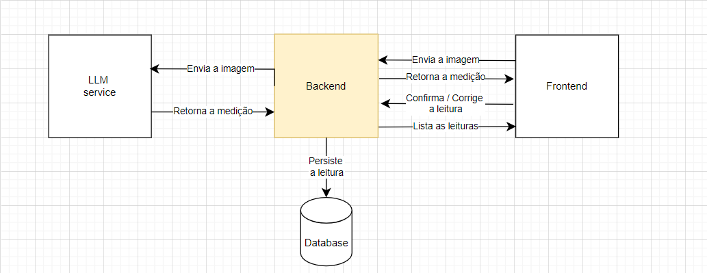

# Shopper Record Meter

Esse projeto é um dos requisitos do teste técnico da Shopper, para vaga de: Desenvolvedor Web Full-Stack Sênior.

Esse teste é dividido em 3 etapas, sendo 2 delas técnicas, com implementação de aplicações. Nessa primeira etapa, o desenvolvimento é de uma API REST.

## Ativar aplicação

Para ativar a aplicação basta executar o comando: `docker compose up -d`;

OBS.: verifique se a porta `8778` estar disponível no host de execução da aplicação.

## Back-end

Esse projeto tem 3 endpoints, sendo que em um deles é necessário integração com uma LLM, sendo escolhida a **Google Gemini**.  

### Objetivo

Desenvolver o back-end de um serviço para leitura individualizada de
consumo de água e gás. Será utilizada uma foto do medidor para coleta da informação, e realizada uma consulta à **Gemini**, onde a IA detectará a medição do mês.

### Requisitos:

  - integração com a LLM **Gemini**, onde a `GEMINI_API_KEY` será fornecida em um arquivo `.env`;
  - a aplicação dever ser dockerizada, devendo conter um arquivo `docker-compose.yml` na raiz do seu repositório;
  - Será criado um arquivo `.env` na raiz do repositório, onde nele conterá as variáveis de ambiente da aplicação;
  - O docker-compose deve ser capaz de subir a aplicação e todos os serviços necessários com um único comando.

### Arquitetura

A Shopper disponibiliza a arquitetura adotada para a aplicação. Podendo ser vista na imagem abaixo.



### Solução

Para esta solução foram utilizadas as bibliotecas:

  - **`Fastify`** - é um framework web de alta performance  e eficiente para **Node.js**, oferece suporte a plugins, validação de esquema, e roteamento otimizado, sendo ideal para construir **APIs** modernas com validações robustas e integração fácil com outras bibliotecas;
  - **`Zod`** - é uma biblioteca de validação de esquemas, para garantir que os dados recebidos por uma **API** estejam no formato correto. Garantindo que os dados sejam validados em tempo de execução;
  - **`Prisma`** - é um **ORM (Object-Relational Mapping)** que facilita a interação com bancos de dados, permitindo consultas **SQL** de forma simplificada. Ele é utilizado para criar, ler, atualizar e deletar dados com facilidade, além de oferecer migrações automáticas de esquema;
  - **`Pino`** - é um _logger_ de alta performance, integrado nativamente ao **Fastify**, usado para registrar logs de forma eficiente em aplicações de grande escala. Detendo suporte a logs estruturados em formato **JSON**, facilitando o monitoramento e depuração. Sendo ideal para rastrear requisições, erros e eventos em ambientes de produção;
  - **`tsx`** - é uma ferramenta para executar arquivos **TypeScript** diretamente no **Node.js** sem a necessidade de pré-compilação, simplificando o fluxo de desenvolvimento. Ele permite execução de código TypeScript de forma imediata durante o desenvolvimento;
  - **`@fastify/static`** - é um plugin para o **Fastify** que permite servir arquivos estáticos, como imagens, CSS e JavaScript, diretamente da sua aplicação.

#### Endpoints

##### POST /upload

Responsável por receber uma imagem em base64, consultar o Gemini e retornar a medida lida pela API.

###### Requisitos

- Validar o tipo de dados dos parâmetros enviados (inclusive o base64);
- Verificar se já existe uma leitura no mês naquele tipo de leitura;
- Integrar com uma API de LLM para extrair o valor da imagem.

###### Request

A requisição para esse endpoint deve ser de acordo com o mostrado abaixo:

```JSON
{
  "image": "base64",
  "customer_code": "string",
  "measure_datetime": "datetime",
  "measure_type": ["WATER", "GAS"]
}
```

Ao receber a requisição esse _endpoint_ irá se comunicar com a **Gemini** e coletar o valor numérico existente na imagem e criar um url temporária para acesso da imagem. Se não ocorrer erros, o retorno correto deve ser fornecido, caso contrário os casos de erro devem ser seguidos de acordo como o informado na especificação.

###### Response

- Um link temporário para a imagem;
- Um GUID da leitura;
- O valor numérico reconhecido pela LLM.

Os retornos devidos devem ser os seguintes:

| Status Code | Descrição                                         | Resposta                                                                                                                                                                                                                                                                                                           |
| ----------- | ------------------------------------------------- | ------------------------------------------------------------------------------------------------------------------------------------------------------------------------------------------------------------------------------------------------------------------------------------------------------------------ |
| 200         | Operação realizada com sucesso                    | `{ “customer_code”: string, “measures”: [ { “measure_uuid”: string, “measure_datetime”: datetime, “measure_type”: string, “has_confirmed”:boolean, “image_url”: string }, { “measure_uuid”: string, “measure_datetime”: datetime, “measure_type”: string, “has_confirmed”:boolean,  “image_url”: string } (…) ] }` |
| 400         | Parâmetro measure type diferente de WATER ou GAS  | `{ “error_code": "INVALID_TYPE", "error_description": <descrição_do_erro> }`                                                                                                                                                                                                                                       |
| 404         | Já existe uma leitura para este tipo no mês atual | `{ "error_code": "MEASURES_NOT_FOUND", "error_description": Nenhuma leitura encontrada" }`                                                                                                                                                                                                                         |

##### PATCH /confirm

Responsável por confirmar ou corrigir o valor lido pela **Gemini**.

###### Requisitos

- Validar o tipo de dados dos parâmetros enviados
- Verificar se o código de leitura informado existe
- Verificar se o código de leitura já foi confirmado
- Salvar no banco de dados o novo valor informado

**OBS: Ele NÃO deve fazer novas consultas à Gemini para validar o novo resultado recebido**.

###### Request

A requisição para a confirmação ou atualização deve ser como mostrada abaixo:

```JSON
{
  "measure_uuid": "string",
  "confirmed_value": number
}
```

Ao receber a requisição, a API irá se comunicar com a base de dados para coletar a medição deseja, e realizar as alterações necessárias na mesma. Em caso de não cumprimento dos critérios determinados um dos erros de resposta deve ser retornado.

###### Response

- Resposta de OK ou ERRO dependendo do valor informado.

| Status Code | Descrição                                                | Resposta                                                                                         |
| ----------- | -------------------------------------------------------- | ------------------------------------------------------------------------------------------------ |
| 200         | Operação realizada com sucesso                           | `{ “success”: true }`                                                                            |
| 400         | Os dados fornecidos no corpo da requisição são inválidos | `{ “error_code": "INVALID_DATA", "error_description": <descrição_do_erro> }`                     |
| 404         | Já existe uma leitura para este tipo no mês atual        | `{ "error_code": "MEASURE_NOT_FOUND", "error_description": "Leitura do mês já realizada" }`      |
| 409         | Leitura já confirmada                                    | `{ "error_code": "CONFIRMATION_DUPLICATE", "error_description": "Leitura do mês já realizada" }` |

##### GET /<customer_code>/list

Responsável por **listar as medidas realizadas** por um determinado cliente, sendo possível filtrar pelo tipos: **GAS** ou **WATER**.

###### Requisitos

- Receber o código do cliente e filtrar as medidas realizadas por ele
- Ele opcionalmente pode receber um query parameter “measure_type”, que deve ser “WATER” ou “GAS”
  - A validação deve ser CASE INSENSITIVE;
  - Se o parâmetro for informado, filtrar apenas os valores do tipo especificado. Senão, retornar todos os tipos.
- Verificar se o código de leitura já foi confirmado
- Salvar no banco de dados o novo valor informado

**OBS: Ex. {base url}/<customer_code>/list?measure_type=WATER**

###### Request

- customer_code: string de identificação do usuário;
- measure_type: tipo da medição.

A requisição deve seguir o padrão informado no exemplo: `{base_url}/customer_code/list` ou `{base_url}/customer_code/list?measure_type=TYPE`.

###### Response

- Retorna uma lista com todas as medições realizadas.

**Lembrando que**, se a requisição for para o primeiro caso informado na _Request_, devem ser retornados todas as medições daquele usuário. Se um tipo válido for informado, devem ser retornadas todas as medições do usuário referentes a esse tipo.

| Status Code | Descrição                                                | Resposta                                                                                         |
| ----------- | -------------------------------------------------------- | ------------------------------------------------------------------------------------------------ |
| 200         | Operação realizada com sucesso                           | `{ “success”: true }`                                                                            |
| 400         | Os dados fornecidos no corpo da requisição são inválidos | `{ “error_code": "INVALID_DATA", "error_description": <descrição_do_erro> }`                     |
| 404         | Já existe uma leitura para este tipo no mês atual        | `{ "error_code": "MEASURE_NOT_FOUND", "error_description": "Leitura do mês já realizada" }`      |
| 409         | Leitura já confirmada                                    | `{ "error_code": "CONFIRMATION_DUPLICATE", "error_description": "Leitura do mês já realizada" }` |

## Desenvolvido por


